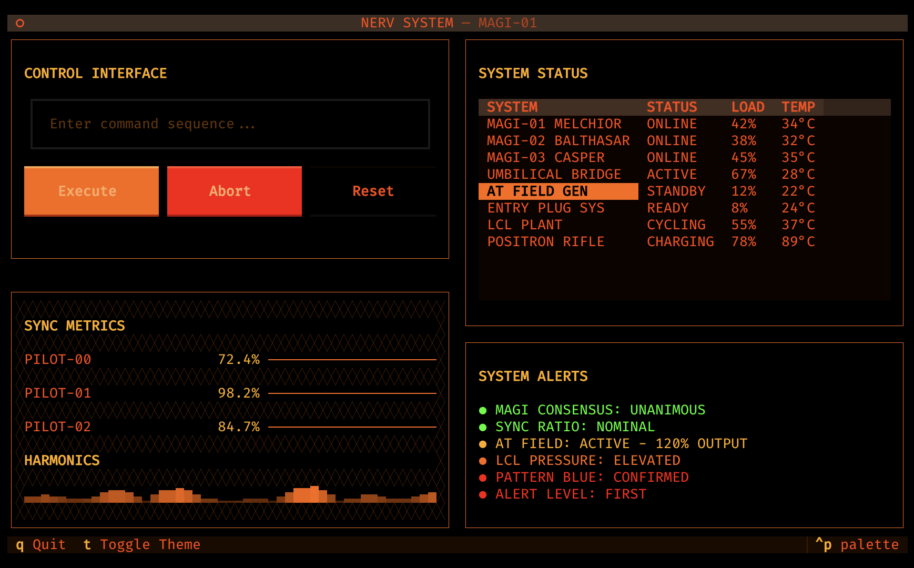

# textual-nerv

NERV theme for Textual applications - an Evangelion-inspired orange/black military aesthetic.

## Installation

```bash
pip install textual-nerv
```

## Usage

```python
from textual.app import App
from textual_nerv import nerv

class MyApp(App):
    def on_mount(self) -> None:
        self.register_theme(nerv)
        self.theme = "nerv"
```

## License

MIT
